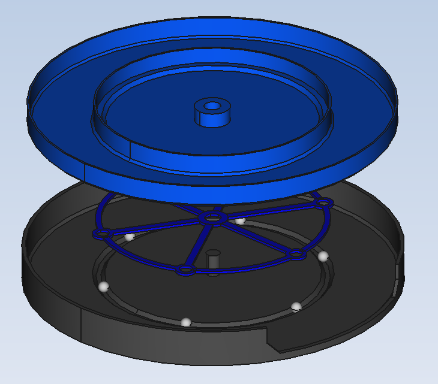

# SMD-assembly-table
A rotating assembly table based on a 3d printed bearing system. Advantages compared to regular bearing desings are stabillity and maintained rotation when downwards pressure is applied.
The 3d printed bearings are also considerably cheaper than regular ones.

